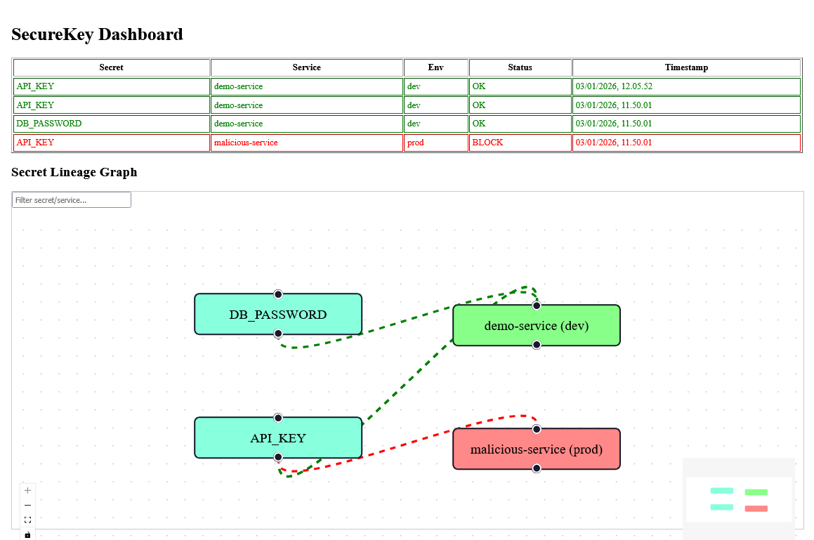

# SecureKey

SecureKey adalah proyek eksperimen DevOps/Cybersecurity yang memonitor penggunaan secret secara runtime dan mencatat lineage secret di seluruh environment/service.

Proyek ini terdiri dari **Agent** untuk monitoring & enforcement, **Tracker** untuk penyimpanan data secret, dan **Dashboard** untuk visualisasi lineage secret.



## Fitur

* **Agent**

  * Monitor penggunaan secret oleh service
  * Validasi secret sesuai policy
  * Block penggunaan secret jika policy dilanggar
  * Kirim log secret usage ke Tracker

* **Tracker**

  * Menyimpan semua pemakaian secret (secret, service, env, status, timestamp)
  * Menyediakan API untuk:

    * `/secrets` → daftar semua secret terbaru
    * `/log` → log secret baru dari Agent
    * `/lineage/:secret` → lineage / riwayat penggunaan secret tertentu

* **Dashboard**

  * Tabel secret usage terakhir
  * Secret Lineage Graph (visualisasi secret → service)

## Instalasi & Jalankan

### 1. Tracker

```bash
cd tracker
go mod init tracker
go mod tidy
go run tracker.go
```

* Tracker akan berjalan di `http://localhost:8080`
* Database SQLite otomatis dibuat (`secrets.db`)

### 2. Agent

```bash
cd agent
go mod init agent
go mod tidy
go run agent.go
```

* Agent akan mengeksekusi simulasi secret usage:

  * `OK` → service diizinkan
  * `BLOCK` → service melanggar policy
* Log dikirim ke Tracker

### 3. Dashboard

```bash
cd dashboard
npm install
npm start
```

* Dashboard tersedia di `http://localhost:3000`
* Graph lineage secret & tabel secret usage otomatis diisi dari Tracker API

---

## API

1. **GET /secrets**

```
curl http://localhost:8080/secrets
```

```json
[
  {
    "secret": "API_KEY",
    "service": "demo-service",
    "env": "dev",
    "status": "OK",
    "timestamp": "2026-01-03T04:38:40Z"
  },
  {
    "secret": "DB_PASSWORD",
    "service": "demo-service",
    "env": "dev",
    "status": "OK",
    "timestamp": "2026-01-03T04:38:40Z"
  }
]
```

2. **POST /log**

```bash
curl -X POST http://localhost:8080/log -d "secret=API_KEY&service=demo-service&env=dev&status=OK"
```

## Policy Agent

* Didefinisikan dalam `config.json`:

```go
[
    {
        "secret_name": "API_KEY",
        "allowed_services": ["demo-service"],
        "allowed_envs": ["dev"]
    },
    {
        "secret_name": "DB_PASSWORD",
        "allowed_services": ["demo-service"],
        "allowed_envs": ["dev"]
    }
]
```

* Jika secret digunakan oleh service **tidak ada dalam policy**, status = `BLOCK`

## Simulasi

1. Jalankan Tracker
2. Jalankan Agent → Agent akan mengirim log ke Tracker
3. Buka Dashboard → lihat tabel & graph lineage secret
4. Periksa secret yang diblok → warna merah pada graph (advanced nanti)

## Catatan

* Database SQLite dibuat otomatis (`secrets.db`)
* Semua log disimpan termasuk status BLOCK/OK
* Dashboard mengambil data dari Tracker API → live update setiap reload

> Seluruh proyek ini dibuat sebagai eksperimen dan proof-of-concept. Sistem ini tidak dimaksudkan untuk digunakan di lingkungan produksi tanpa peninjauan, pengujian, dan penyesuaian lebih lanjut. Tujuannya adalah untuk mengeksplorasi ide “Secret Runtime Firewall & Secret Lineage Tracker” secara prototipe.